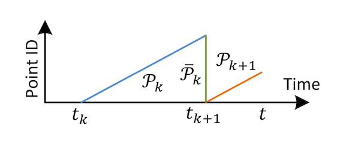
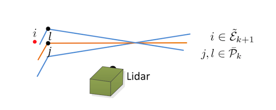
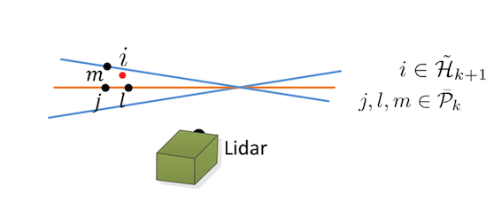

# laserOdometry.cpp

## Transformation of Point-cloud

- `t_last_curr`: $$^{k-1}t_{k}$$
- `q_last_curr`: $$^{k-1}q_{k}$$

```c
void TransformToStart(PointType const *const pi, PointType *const po);
```

- 라이다 포인트의 왜곡보정 (undistort)를 수행함.
- k 번째 sweep 동안 얻어진 점들을 k 번째 sweep의 시작 시점의 좌표계로 변환한다. ( $$\mathcal{P}_{k}$$ 생성)
  - DISTORTION 매크로가 0이면, 현재 point cloud를 마지막 스캔의 좌표계에 맞게 변환한다.
  - DISTORTION 매크로가 0이 아니면, intensity의 소수점 값을 SCAN_PERIOD로 나누어 s \(interpolation ratio\)를 구하고, 그것만큼 모션을 보정한다.
- 여기서 intensity는 scan 시점으로 생각된다.

```c
void TransformToEnd(PointType const *const pi, PointType *const po);
```

- k 번째 sweep 동안 얻어진 라이다 포인트를 k+1 번째 sweep 시작 시점의 좌표계에 맞추어 변환한다. ( $$\bar{\mathcal{P}_{k}}$$ 생성 )
- 변환 후 intensity의 소수값을 없애준다.

### main

- ros msgs를 100 Hz로 가져온다.
- 메세지 수신되기를 대기하다가 수신되면,
  - 각 메세지를 읽어온 후, 정상여부 판단(time stamp)해서 다음 5개의 메모리에 각각 복사한다.
    - `cornerPointsSharp`: $$\tilde{\mathcal{E}}_{k}$$과 관련된 라이다 입력 ($$L_{k}$$로 좌표변환 전)

- $$\tilde{\mathcal{E}}_k =$$ odometry를 위해 사용하는 corner features ($$\tilde{\mathcal{E}}_{k} \subset \mathcal{E}_{k}$$), 4개의 subregion 각각에서 curvature가 가장 큰 2개의 점)

- `cornerPointsLessSharp`: $$\mathcal{E}_{k}$$과 관련된 라이다 입력 ($$L_{k}$$로 좌표변환 전)
  - $$\mathcal{E}_{k} =$$ mapping에 사용할 corner features, 4개의 subregion 각각에서 curvature가 가장 큰 20개의 점들
- `surfPointsFlat`: $$\mathcal{S}_{k}$$과 관련된 라이다 입력 ($$L_{k+1}$$로 좌표변환 전)
  - $$\tilde{\mathcal{H}}_{k} =$$ odometry를 위해 odometry를 위해 사용하는 planar features ($$\tilde{\mathcal{S}}_{k} \subset \mathcal{H}_{k}$$), 4개의 subregion에서 curvature가 가장 낮은 4개의 점들

- `surfPointsLessFlat`: $$\mathcal{H}_{k}$$과 관련된 라이다 입력 ($$L_{k}$$로 좌표변환 전)
  - $$\mathcal{H}_{k} = $$ 나중에 mapping에 사용할 planar features, 4개의 subregion에서 curvature가 가장 낮은 20개의 점들

- `laserCloudFullRes`: $$\mathcal{P}_{k} = \left[\mathcal{E}_{k}, \mathcal{H}_{k}\right]$$
    

- 초기화를 체크한다.
  - `systemInited`를 1로 설정한다.

- 초기화 되어있면, 2번 iteration 수행하여 `t_w_curr` ($$^{w}\mathbb{t}_{L_{k}}$$),`q_w_curr`($$^{w}\mathbb{q}{L_{k}}$$)을 구한다.
  - ceres LossFunction 설정: HuberLoss
  - ceres LocalParameterization 설정: `Eigen_Quaternion_Parameterization`
  - ceres problem을 생성하고, rotation (quaternion)과 translation에 대한 parameter를 설정한다.
    - `cornerPointsSharp` ($$\tilde{\mathcal{E}}_{k}$$)에 있는 점들과 `cornerPointLast` ($$\mathcal{E}_{k-1}$$) 있는 점들과의 연관성을 찾는다.
    - `surfPointsFlat` ($$\tilde{\mathcal{H}}_{k}$$)에 있는 점들과 `surfPointsLessFlat` ($$\mathcal{H}_{k-1}$$)에 있는 점들과의 연관성을 찾는다.
- ceres solver를 수행한다.
  - linear_solver_type: `DENSE_QR`
  - num_iteration: 4
- odoemetry 수행 결과를 출력한다.
  - laserOdometry, laserPath
- k 번째 sweep 동안 얻어진 라이다 포인트를 k+1 번째 sweep 시작 시점( = k번째 sweep 종료 시점)의 좌표계에 맞추어 변환한다 ($$\bar{\mathcal{P}}_{k}$$). [Check: 코드상에서 수행안함. 데이터 자체가 이렇게 들어오는지 확인 필요함.]
  - `cornerPointsLessSharp`: $$\mathcal{E}_{k} \rightarrow \bar{\mathcal{E}_{k}}$$
  - `cornerPointsLessSharp`: $$\mathcal{H}_{k} \rightarrow \bar{\mathcal{H}_{k}}$$
  - `laserCloudFullResNum`: $$\mathcal{P}_{k} \rightarrow \bar{\mathcal{P}_{k}}$$
  - 위의 데이터들을 ros를 통해 100 Hz로 새로 읽어들인 데이터이다.
- 현재 특징점 정보를 이전 특징점 정보로 복사한다.
  - Corner features
    - `cornerPointsLessSharp` -> `laserCloudTemp` ($$\mathcal{E}_{k}$$를 임시변수에 복사)
    - `laserCloudCornerLast` -> `cornerPointsLessSharp` (why?)
    - `laserCloudTemp` -> `laserCloudCornerLast` ( 다음 scan 입력 시 사용하기 위해 $$\mathcal{E}_{k} \rightarrow \mathcal{E}_{k-1}$$로 복사)
  - Planar features
    - `surfPointsLessFlat` -> `laserCloudTemp` ($$\mathcal{H}_{k}$$를 임시변수에 복사)
    - `laserCloudSurfLast` -> `surfPointsLessFlat` (why?)
    - `laserCloudTemp` -> `laserCloudSurfLast` (다음 scan 입력 시 사용하기 위해 $$\mathcal{E}_{k} \rightarrow \mathcal{E}_{k-1}$$로 복사)
- kdTree에 `laserCloudCornerLast`, `laserCloudSurfLast`를 입력으로 넣어준다.
- `skipFrameNum`에 맞추어 Point-Cloud를 publish한다.
  - `laserCloudCornerLast`
  - `laserCloudSurfLast`
  - `laserCloudFullRes`

#### Correspondence search for corner features

##### Corner Correspondence Logic

1. $$i \in \tilde{\mathcal{E}}_{k}$$를 선택한다.

1. $$\bar{\mathcal{P}}_{k-1}$$에서 가장 가까운 점 $$j$$를 구한다. ($$j \in \bar{\mathcal{P}}_{k-1}$$)

1. $$j$$와 연속적으로 위치한 다른 scan 상의 점 $$l$$을 찾는다. ($$l \in \bar{\mathcal{P}}_{k-1}$$)

1. 이렇게 구한 $$(j,l)$$이 Edge points라는 것을 증명하기 위해 Local Surface의 Smoothness $$𝒄$$ 를 계산한다.
   - 여기서, $$S$$는 같은 scan 데이터에서 𝑖와 연쇄적(Consecutive)으로 위치한 다른 점들의 집합 (코드 상에서는 양 옆으로 5개 씩)
   - 여기서, $$i$$ 와 $$j$$ 는 1, 2의 $$i$$ 와 $$j$$와 다르다.

    $$
    c = \frac{1}{\lvert \mathcal{S}\rvert \cdot \lVert \mathbb{X}^{L}_{(k,i)}\rVert} \cdot \left\lVert{\sum\limits_{j\in \mathcal{S}, j  \neq i}{\mathbb{X}^L_{(k,i)} - \mathbb{X}^L_{(k,j)} }}\right\rVert
    $$

1. $$(j,l)$$이 Edge feature이면, $$i$$와 $$(j,l)$$ edge 사이의 거리를 다음의 공식으로 구한다.
   - 이 거리를 최소화하도록 최소화를 할 것이다.
    
    $$
    d_{\mathcal{E}} = \frac{\left\lVert{\left(\mathbb{X}^L_{(k,i)} - \bar{\mathbb{X}}^L_{(k-1,j)}\right)\times \left(\mathbb{X}^L_{(k,i)} - \bar{\mathbb{X}}^L_{(k-1,l)}\right)}\right\rVert}{\left\lVert{\bar{\mathbb{X}}^L_{(k-1,j)} - \bar{\mathbb{X}}^L_{(k-1,l)}}\right\rVert}
    $$

- Remarks
  - 4,5는 laserOdometry.cpp 상에 구현되어 있지 않다.
  - 4는 미리 scanRegistration.cpp에서 처리한다.
  - 5는 lidarFactor.hpp에서 처리한다.



### Corner Correspondence Implementation

- `cornerPointSharp`에 들어있는 점의 수만큼 루프를 반복한다.
- `cornerPointSharp`에 있는 라이다 입력을 sweep의 시작 시점의 좌표계로 변환한다.
  - Lidar raw input을 $$\mathcal{C}_{k+1}$$로 변환한다.
- `PointLessSharp`에 있는 점 중에서 현재의 `PointSharp`와 가장 가까운 점을 KdTree로 찾는다.
- 가장 가까운 점까지의 square distance가 threshold보다 작으면, 근처 (2 scan 정도 내)의 점들에 대하여 가장 가까운 점을 찾는다.
  - scan line이 증가하는 방향으로 탐색을 수행해서
    - 같은 scan line이면, continue: 루프 상단으로 돌아간다.
    - 근처 스캔 라인을 벗어나면 (`NEARBY_SCAN`), 루프를 중단한다.
    - 근처 스캔라인에서 squared distance를 계산하고 가장 가까운 점을 계산하고 index를 저장한다.
  - scan line이 감소하는 방향으로 탐색을 수행해서 동일한 과정을 거친다.
- 유효한 점이 찾아지면, 다음의 정보를 저장하고 LidarEdgeFactor를 생성한다.
  - `curr_point`: 현재 point (`cornerPointsSharp`중 한 점)
  - `last_point_a`: `cornerPointLessSharp` 중 현재 점과 가장 가까운 점
  - `last_point_b`: `last_point_a`와 다른 scan line 중 가장 가까운 점

#### Correspondence search for planar features

##### Plane Correspondence Logic

1. $$i \in \tilde{\mathcal{H}}_{k}$$를 선택한다.

1. $$\bar{\mathcal{P}}_{k-1}$$에서 가장 가까운 점 $$j$$를 구한다. ($$j \in \bar{\mathcal{P}}_{k-1}$$)

1. $$j$$와 연속적으로 위치한 같은 scan 상의 점 $$l$$을 찾는다. ($$l \in \bar{\mathcal{P}}_{k-1}$$)

1. $$j$$와 연속적으로 위치한 다른 scan 상의 점 $$m$$을 찾는다. ($$m \in \bar{\mathcal{P}}_{k-1}$$)

1. 이렇게 구한 $$(j,l,m)$$이 Planar points라는 것을 증명하기 위해 Local Surface의 Smoothness $$𝒄$$ 를 계산한다.
   - 여기서, $$S$$는 같은 scan 데이터에서 𝑖와 연쇄적(Consecutive)으로 위치한 다른 점들의 집합 (코드 상에서는 양 옆으로 5개 씩)
   - 여기서, $$i$$ 와 $$j$$ 는 1, 2의 $$i$$ 와 $$j$$와 다르다.

    $$
    c = \frac{1}{\lvert s \rvert \cdot \lVert \mathbb{X}_(k,i)^{L}\rVert} \cdot \left\lVert{\sum\limits_{j\in S, j  \neq i}{\mathbb{X}^L_{(k,i)} - \mathbb{X}^L_{(k,j)} }}\right\rVert
    $$

1. $$(j,l,m)$$이 Plane feature이면, $$i$$와 $$(j,l,m)$$ plane 사이의 거리를 다음의 공식으로 구한다.
   - 이 거리를 최소화하도록 최소화를 할 것이다.
    $$
    d_{\mathcal{H}} = \left(\mathbb{X}^L_{(k,i)} - \bar{\mathbb{X}}^L_{(k-1,j)}\right)\cdot\frac{{{\left(\mathbb{X}^L_{(k-1,j)} - \bar{\mathbb{X}}^L_{(k-1,l)}\right)\times \left(\mathbb{X}^L_{(k-1,j)} - \bar{\mathbb{X}}^L_{(k-1,m)}\right)}}}{\left\lVert{\left(\mathbb{X}^L_{(k-1,j)} - \bar{\mathbb{X}}^L_{(k-1,l)}\right)\times \left(\mathbb{X}^L_{(k-1,j)} - \bar{\mathbb{X}}^L_{(k-1,m)}\right)}\right\rVert}
    $$

- Remarks
  - 4,5는 laserOdometry.cpp 상에 구현되어 있지 않다.
  - 4는 미리 scanRegistration.cpp에서 처리한다.
  - 5는 lidarFactor.hpp에서 처리한다.



### Plane Correspondence Implementation

- `surfPointFlat`에 들어있는 점의 수만큼 루프를 반복한다.
- `surfPointFlat`에 있는 점을 sweep의 시작 시점의 좌표계로 변환한다.
- `surfPointLessFlat`에 있는 점 중에서 현재의 `surfPointFlat`에 가장 가까운 점을 KdTree로 찾는다.
- 가장 가까운 점까지의 square distance가 threshold보다 작으면, 근처\(2 scan\) 정도 내의 점들에 대하여 가장 가까운 점을 찾는다.
  - scan line이 증가하는 방향으로 탐색을 수행해서
    - 근처 scan이 아니면 루프를 중단한다.
    - 같거나 낮은 근처 scan에서 가장 가까운 점의 인덱스를 별도로 저장한다. (`minPointSqDis2`, `minPointInd2`)
    - 높은 scan에서 가장 가까운 점의 인덱스를 별도로 저장한다. (``minPointSqDis3`,`minPointInd3`)
  - scan line이 감소하는 방향으로 탐색을 수행해서 Check
    - 근처 scan이 아니면 루프를 중단한다.
    - 같거나 높은 근처 scan에서 가장 가까운 점의 인덱스를 별도로 저장한다. (`minPointSqDis2`,`minPointInd2`)
    - 낮은 scan에서 가장 가까운 점의 인덱스를 별도로 저장한다. (`minPointSqDis3`, `minPointInd3`)
- 유효한 점이 찾아지면, 다음의 정보를 저장하고 LidarPlaneFactor를 생성한다.
  - `curr_point`: 현재 point (`surfPointFlat` 중 한 점)
  - `last_point_a`: `surfPointLessFlat` 중 현재 점과 가장 가까운 점
  - `last_point_b`: `last_point_a`와 높거나 같은 scan line 중 가장 가까운 점
  - `last_point_c`: `last_point_a`와 낮은 scan line 중 가장 가까운 점

## Cloud point handler

```c
void laserCloudSharpHandler(const sensor_msgs::PointCloud2ConstPtr &cornerPointsSharp2);
void laserCloudLessSharpHandler(const sensor_msgs::PointCloud2ConstPtr &cornerPointsLessSharp2);
void laserCloudFlatHandler(const sensor_msgs::PointCloud2ConstPtr &surfPointsFlat2);
void laserCloudLessFlatHandler(const sensor_msgs::PointCloud2ConstPtr &surfPointsLessFlat2);
void laserCloudFullResHandler(const sensor_msgs::PointCloud2ConstPtr &laserCloudFullRes2);
```

- mutex lock을 한 다음, msgs를 각각의 msgs에 할당된 버퍼에 복사한다.
