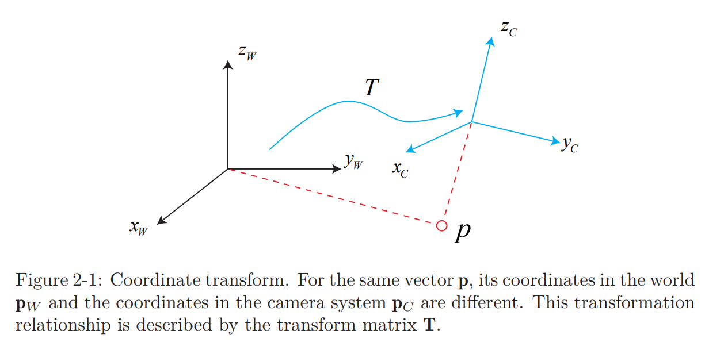

# 3D Rigid Body Motion
| **Goal of Study**
| 1. 3차원 공간 상의 강체 기하학(회전 행렬, 변환 행렬, 쿼터니온, 오일러 각)에 대해 학습
| 2. `Eigen Library`과 기하학 모듈의 사용법에 대해 학습

* 3차원 공간 상의 강체의 운동은 어떻게 기술하는 방법에 대해 학습
* 회전(rotation)을 다루기 위한 회전 행렬, 쿼터니온(quaternions), 오일러 각(Euler angle)에 대해 소개
* 계산을 위한 선형 대수 라이브러리인 Eigen을 활용한 실습 진행

## 회전 행렬(Rotation Matrix)
### 점, 벡터, 그리고 좌표계(Points, Vectors, and Coordinate Systems)
* 3차원 공간 상의 점은 3개의 좌표로 구체
* 강체(Rigid body)의 경우 *위치*와 *회전*을 고려
* 점은 공간의 기본 요소로써 길이와 부피가 없음
* 벡터는 두개의 점을 연결한 화살표
* 3차원 공간은 $\mathbb{R}^3$로 나타낼 수 있고, 베이스는 $\begin{pmatrix} \mathbf{e}_1 & \mathbf{e}_2 & \mathbf{e}_3 \end{pmatrix}$로 나타냄
* 벡터 $\mathbf{a}$의 좌표는 아래와 같이 나타낼 수 있음
  $$\begin{equation}
  \mathbf{a} = \begin{bmatrix} \mathbf{e}_1 & \mathbf{e}_2 & \mathbf{e}_3 \end{bmatrix} \begin{bmatrix} a_1 \\ a_2 \\ a_3 \end{bmatrix} = a_1 \mathbf{e}_1 + a_2 \mathbf{e}_2 + a_3 \mathbf{e}_3 
  \end{equation}$$
* $ \mathbf{a}, \mathbf{b} \in \mathbb{R}^3$인 경우의 내적(inner product)과 외적(outer product)의 정의
  $$\begin{equation}
  \mathbf{a} \cdot \mathbf{b} = \mathbf{a}^T\mathbf{b} = \sum_{i=1}^{3}{a_i}{b_i} = \vert\mathbf{a}\vert\vert\mathbf{b}\vert\cos{\langle\mathbf{a}, \mathbf{b}\rangle}
  \end{equation}$$
  $$\begin{equation}
  \mathbf{a} \times \mathbf{b} = \begin{Vmatrix}\mathbf{e}_1 & \mathbf{e}_2 & \mathbf{e}_3 \\ a_1 & a_2 & a_3 \\ b_1 & b_2 & b_3\end{Vmatrix} = \begin{bmatrix}{a_2}{b_3}-{a_3}{b_2}\\{a_3}{b_1}-{a_1}{b_3}\\{a_1}{b_2}-{a_2}{b_1}\end{bmatrix} = \begin{bmatrix}0 & -a_3 & a_2 \\ a_3 & 0 & -a_1 \\ -a_2 & a_1 & 0 \end{bmatrix} \mathbf{b} \overset{\Delta}{=} \mathbf{a}^{\wedge}\mathbf{b}
  \end{equation}$$
  $$\begin{equation}
  \mathbf{a}^{\wedge} = \begin{bmatrix}0 & -a_3 & a_2 \\ a_3 & 0 & -a_1 \\ -a_2 & a_1 & 0 \end{bmatrix} (Skew-symmetric matrix)
  \end{equation}$$
  
  ### 좌표계간의 유클리드 변환(Euclidean Transformation Between Coordinate Systems)
* 
* World 좌표계 $\mathbf{p}_w = \left(x_W, y_W, z_W\right)$에서 카메라 좌표계 $\mathbf{p}_c = \left(x_C, y_C, z_C\right)$로의 변환 행렬 $\mathbf{T}$
  
* 이러한 변화를 강체 운동(rigid body motion)이라 함
  * 회전 + 변환

